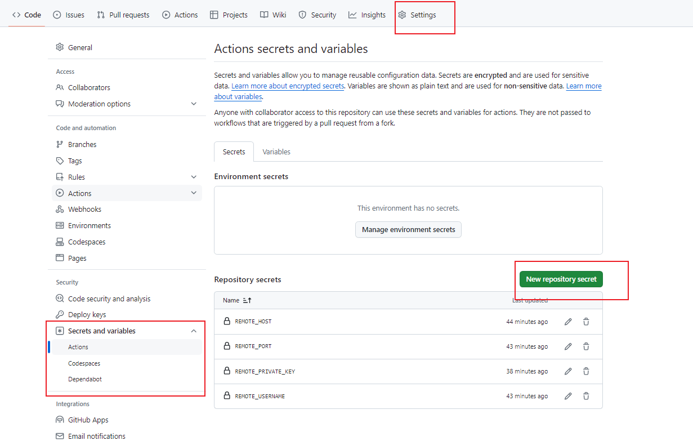

# vuepress部署

## nginx容器创建

### 拉取nginx
``` bash
podman pull nginx:alpine3.19
```

### 启动容器
``` bash
# 启动容器
podman run -d --name web-nginx nginx:alpine3.19
# nginx配置目录所在位置 /etc/nginx
# 复制容器配置到宿主机上（方便修改文件）
podman cp web-nginx:/etc/nginx/. /home/nginx/conf
# 复制容器html目录到宿主机上
podman cp web-nginx:/usr/share/nginx/html/. /home/nginx/html
# 删除容器
podman rm -f web-nginx
# 重新创建容器 映射目录
# -v 主机目录:容器目录
# -p 主机端口:容器端口
podman run -d --name web-nginx -p 8001:80  -v /home/nginx/conf:/etc/nginx -v /home/nginx/html:/usr/share/nginx/html nginx:alpine3.19
```

### 测试服务
浏览器打开网址 http://IP:8001


## github自动化部署

> 用github自动化打包后代码推送到服务器上部署


### actions
先进入github的Actions,创建一个yml自动化文件

### 编写yml
``` bash
# This workflow will do a clean installation of node dependencies, cache/restore them, build the source code and run tests across different versions of node
# For more information see: https://docs.github.com/en/actions/automating-builds-and-tests/building-and-testing-nodejs
name: vuepress

on:
  push:
    branches: [ "main" ]
  pull_request:
    branches: [ "main" ]

jobs:
  build:

    runs-on: ubuntu-latest
    
    steps:
    - name: 拉取代码
      uses: actions/checkout@v4
    
    - name: 添加node环境
      uses: actions/setup-node@v3
      with:
        node-version: 18.x
  
    - name: 安装pnpm
      uses: pnpm/action-setup@v4.0.0
      with:
        version: 9.4.0

    - name: 打包
      run: |
        pnpm install
        pnpm run docs:build

     # https://github.com/appleboy/scp-action
    - name: 部署到服务器
      uses: appleboy/scp-action@master
      with:
        host: ${{ secrets.REMOTE_HOST }} # 公网ip
        username: ${{ secrets.REMOTE_USERNAME }} # 用户名
        key: ${{ secrets.REMOTE_PRIVATE_KEY }} # ssh key
        source: "docs/.vuepress/dist/*" # 发送文件
        target: "/home/nginx/html/vuepress" # 目标目录
        strip_components: 3 # 移除指定数量的前导路径元素---不添加会保留前面的文件夹
        rm: true # 删除之前的文件
```

### ssh key生成
- 设置 SSH 密钥
``` bash
ssh-keygen -t rsa -b 4096 -C "your_email@example.com"
```
将生成的公钥 (~/.ssh/id_rsa.pub) 添加到你的服务器的 ~/.ssh/authorized_keys 文件中。
- 添加密钥到 GitHub Secrets
将私钥 (~/.ssh/id_rsa) 的内容复制，并添加到 GitHub 仓库的 Secrets 中。比如命名为 REMOTE_PRIVATE_KEY

### secrets配置
在github的settings目录下的

